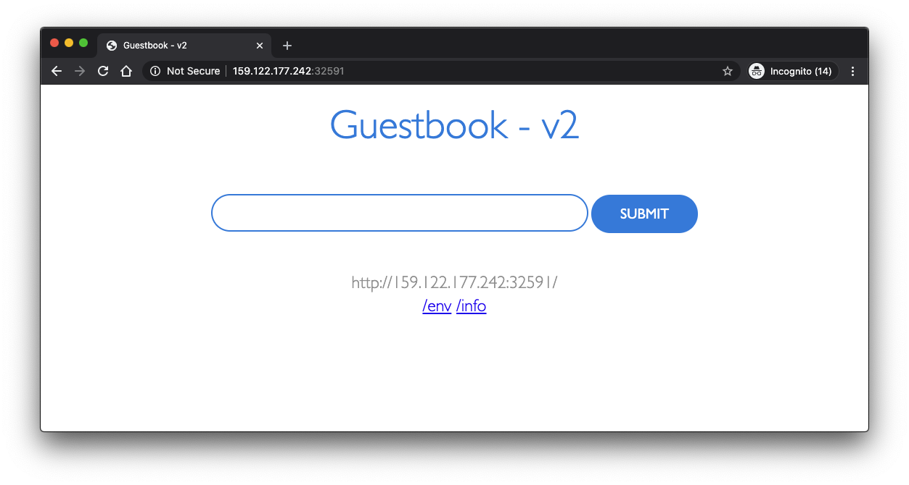
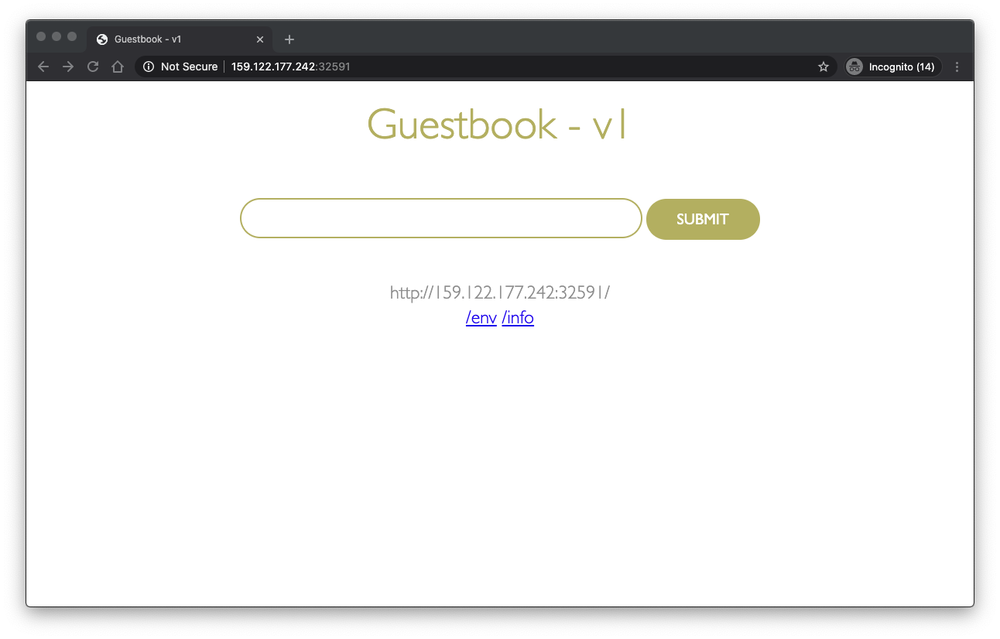

# Lab 2: Scale and Update Deployments

In this lab, you'll learn how to update the number of instances
a deployment has and how to safely roll out an update of your application
on Kubernetes.

For this lab, you need a running deployment of the `guestbook` application
from the previous lab. If you need to create it, go to Lab 1, step 1.

<!-- ```shell
kubectl create deployment guestbook --image=ibmcom/guestbook:v1
``` -->

## 2. Update and roll back apps

Kubernetes allows you to do rolling upgrade of your application to a new
container image. This allows you to easily update the running image and also allows you to
easily undo a rollout if a problem is discovered during or after deployment.

In the previous lab, we used an image with a `v1` tag. For our upgrade
we'll use the image with the `v2` tag.

To update and roll back:

1. Using `kubectl`, you can now update your deployment to use the
   `v2` image. `kubectl` allows you to change details about existing
   resources with the `set` subcommand. We can use it to change the
   image being used.

    ```shell
    kubectl set image deployment/guestbook guestbook=ibmcom/guestbook:v2
    ```

   Note that a pod could have multiple containers, each with its own name.
   Each image can be changed individually or all at once by referring to the name.
   In the case of our `guestbook` Deployment, the container name is also `guestbook`.
   Multiple containers can be updated at the same time.
   ([More information](https://kubernetes.io/docs/reference/generated/kubectl/kubectl-commands#-em-image-em-).)

1. To check the status of the rollout, run:

   ```shell
   kubectl rollout status deployment/guestbook
   ```   

  The rollout might occur so quickly that the following messages
   might _not_ display:

   ```shell
   $ kubectl rollout status deployment/guestbook
   Waiting for rollout to finish: 2 out of 10 new replicas have been updated...
   Waiting for rollout to finish: 3 out of 10 new replicas have been updated...
   Waiting for rollout to finish: 3 out of 10 new replicas have been updated...
   Waiting for rollout to finish: 3 out of 10 new replicas have been updated...
   Waiting for rollout to finish: 4 out of 10 new replicas have been updated...
   Waiting for rollout to finish: 4 out of 10 new replicas have been updated...
   Waiting for rollout to finish: 4 out of 10 new replicas have been updated...
   Waiting for rollout to finish: 4 out of 10 new replicas have been updated...
   Waiting for rollout to finish: 4 out of 10 new replicas have been updated...
   Waiting for rollout to finish: 5 out of 10 new replicas have been updated...
   Waiting for rollout to finish: 5 out of 10 new replicas have been updated...
   Waiting for rollout to finish: 5 out of 10 new replicas have been updated...
   Waiting for rollout to finish: 6 out of 10 new replicas have been updated...
   Waiting for rollout to finish: 6 out of 10 new replicas have been updated...
   Waiting for rollout to finish: 6 out of 10 new replicas have been updated...
   Waiting for rollout to finish: 7 out of 10 new replicas have been updated...
   Waiting for rollout to finish: 7 out of 10 new replicas have been updated...
   Waiting for rollout to finish: 7 out of 10 new replicas have been updated...
   Waiting for rollout to finish: 7 out of 10 new replicas have been updated...
   Waiting for rollout to finish: 8 out of 10 new replicas have been updated...
   Waiting for rollout to finish: 8 out of 10 new replicas have been updated...
   Waiting for rollout to finish: 8 out of 10 new replicas have been updated...
   Waiting for rollout to finish: 8 out of 10 new replicas have been updated...
   Waiting for rollout to finish: 9 out of 10 new replicas have been updated...
   Waiting for rollout to finish: 9 out of 10 new replicas have been updated...
   Waiting for rollout to finish: 9 out of 10 new replicas have been updated...
   Waiting for rollout to finish: 1 old replicas are pending termination...
   Waiting for rollout to finish: 1 old replicas are pending termination...
   Waiting for rollout to finish: 1 old replicas are pending termination...
   Waiting for rollout to finish: 9 of 10 updated replicas are available...
   Waiting for rollout to finish: 9 of 10 updated replicas are available...
   Waiting for rollout to finish: 9 of 10 updated replicas are available...
   deployment "guestbook" successfully rolled out
   ```

1. Test the application as before, by accessing `<public-IP>:<nodeport>`
   in the browser to confirm your new code is active.

   Remember, to get the "nodeport" and "public-ip" use the following commands. Replace `$CLUSTER_NAME` with the name of your cluster if the environment variable is not set.:

   ```shell
   kubectl describe service guestbook
   ```
   and
   ```shell
   ibmcloud ks workers --cluster $CLUSTER_NAME
   ```

   To verify that you're running "v2" of guestbook, look at the title of the page,
   it should now be `Guestbook - v2`. If you are using a browser, make sure you force refresh (invalidating your cache).

   

1. If you want to undo your latest rollout, use:

   ```shell
   kubectl rollout undo deployment guestbook
   ```

   You can then use this command to see the status:
   ```shell
   kubectl rollout status deployment/guestbook
   ``` 

1. When doing a rollout, you see references to *old* replicas and *new* replicas.
   The *old* replicas are the original 10 pods deployed when we scaled the application.
   The *new* replicas come from the newly created pods with the different image.
   All of these pods are owned by the Deployment.
   The deployment manages these two sets of pods with a resource called a ReplicaSet.
   We can see the guestbook ReplicaSets with:

   ```shell
   $ kubectl get replicasets -l app=guestbook
   NAME                   DESIRED   CURRENT   READY     AGE
   guestbook-5f5548d4f    10        10        10        21m
   guestbook-768cc55c78   0         0         0         3h
   ```

To check the rollback:



Before we continue, let's delete the application so we can learn about
a different way to achieve the same results:

 To remove the deployment, use 
 ```shell
 kubectl delete deployment guestbook
 ```

 To remove the service, use:
 ```shell
 kubectl delete service guestbook
 ```


Congratulations! You deployed the second version of the app. Lab 2
is now complete. Continue to the [next lab of this course](../Lab3/README.md).
